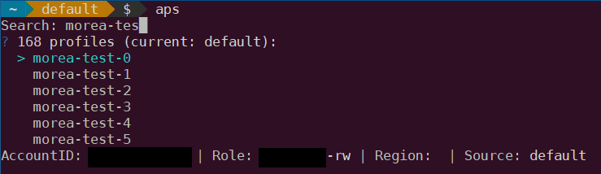
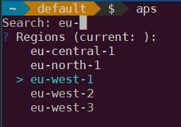

# APS - Amazon Profile Switcher

## Description

Easy switch between AWS Profiles and Regions.

## Why

As a service provider we have to switch all the time between our customers' accounts and as lazy DevOps we do no want to always pass same args to our commands. Environment variables are so a good solution for helping us. Here comes **APS** aka **Amazon Profile Switcher**.

## Usage

```bash
usage: aps [<flags>]

Flags:
      --help                     Show context-sensitive help (also try --help-long and --help-man).
  -x, --clear                    Clear env vars related to AWS
  -c, --config=$HOME/.aws/config AWS config file
  -p, --profile=PROFILE          Specify directly the AWS Profile to use
  -r, --region=REGION            Region selector
  -a, --assume=ASSUME            If false, auto assume role is disabled (default is true)
```

You can select your profile/region by &larr;, &uarr;, &rarr; &darr; and filter by **Name**, or **AccountId** (only for profile). **Enter** key to validate. 

## Output Example




## Build

```bash
make all
```
This repository uses `go mod`, so don't `git clone` inside your `$GOPATH`.

## Author

Thomas Labarussias (thomas.labarussias@qonto.com - https://github.com/Issif)